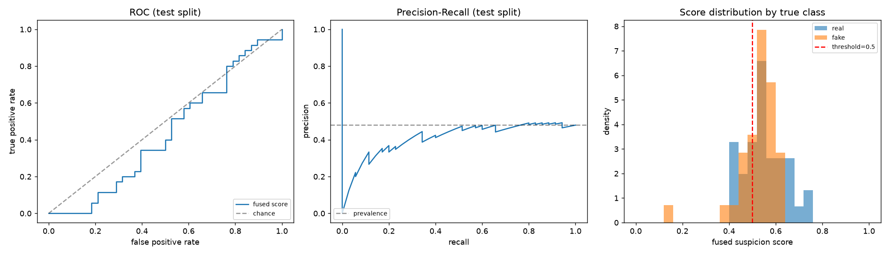

# Evaluation Report

**Run date:** 2026-08-02 · **Split:** test (n=73) · **Dataset:** `datasets/manifest_normalized.csv`
· **Raw data:** `reports/evaluation/predictions.csv` · **JSON:** `reports/evaluation/evaluation_test.json`

---

## Headline result: the pipeline does not currently detect AI-generated images

This is the project's first real measurement. It is a negative result, reported in full.

| Metric | Value | Bar to beat | Verdict |
|---|---:|---:|---|
| **ROC-AUC** | **0.4331** (95% CI 0.301–0.579) | 0.5797 (content-stats baseline) | **fails** |
| **Accuracy** | **0.4658** | 0.5205 (majority class) | **fails** |
| PR-AUC | 0.4219 | 0.4795 (prevalence) | fails |
| Precision (fake) | 0.4630 | — | — |
| Recall (fake) | 0.7143 | — | — |
| F1 (fake) | 0.5618 | — | — |

Confusion matrix: **TN=9, FP=29, FN=10, TP=25**

**Plain reading:** the fused score carries no usable signal on this data. Predicting "real" for
every image would score *higher* accuracy (0.5205) than the pipeline does (0.4658). A classifier
using nothing but image saturation and brightness scores a higher AUC (0.5797) than the entire
11-signal pipeline (0.4331).

**Statistical honesty:** the AUC confidence interval is **0.301–0.579**, which *includes 0.5*. So
the correct claim is **"indistinguishable from chance"**, not "reliably worse than chance." The
point estimate falls below 0.5, but at n=73 that is not separable from noise. What *is* solid is
the upper bound: the interval's top is 0.579, so the data rules out this pipeline being a strong
detector.



The ROC curve tracks below the chance diagonal, and the real/fake score histograms sit almost
perfectly on top of each other. There is no threshold that separates them.

---

## Why: three distinct failures

### 1. The system flags almost everything as suspicious

- **Predicted fake rate: 74.0%** vs **actual fake rate: 48.0%**
- Score range: **[0.158, 0.737]** — everything is crushed into a narrow band around the 0.5
  verdict threshold
- Mean score for **real** images: **0.5512**
- Mean score for **fake** images: **0.5226**

Real images score *higher* (more suspicious) on average than fakes. This is the direct,
quantified consequence of the uncalibrated squashing functions flagged in the original
engineering review: `x/(x+1)`-style transforms map every input into the middle of the range, so
the verdict is decided by arithmetic noise around an arbitrary 0.5 cutoff.

### 2. Five of six applicable signals point the wrong way

Standalone ROC-AUC per signal, on each signal's own applicable subset. **"INVERTED" means the
signal rates real images as *more* suspicious than fakes** — worse than uninformative.

| Signal | applicable | AUC | 95% CI | direction |
|---|---:|---:|---|---|
| `deep_learning` | 100% | 0.4910 | 0.363–0.634 | INVERTED (≈chance) |
| `frequency_analysis` | 100% | **0.3391** | 0.220–0.474 | **INVERTED** |
| `compression_analysis` | 100% | 0.4030 | 0.276–0.535 | INVERTED |
| `lighting_analysis` | 100% | **0.2812** | 0.173–0.404 | **INVERTED** |
| `broadcast_overlay_analysis` | 100% | 0.4895 | 0.357–0.626 | INVERTED (≈chance) |
| `crowd_texture_analysis` | 100% | 0.5259 | 0.406–0.641 | correct (≈chance) |
| `landmark_instability` | **0%** | — | — | never fires on stills |
| `optical_flow_analysis` | **0%** | — | — | never fires on stills |
| `temporal_consistency` | **0%** | — | — | never fires on stills |
| `jersey_color_consistency` | **0%** | — | — | never fires on stills |
| `scene_consistency` | **0%** | — | — | never fires on stills |

`lighting_analysis` (0.281) and `frequency_analysis` (0.339) are *consistently* wrong — their CIs
sit almost entirely below 0.5. A consistently-inverted signal is not noise; it carries real
information with the sign reversed. Under the current equal-weight fusion they actively drag the
verdict away from the truth.

The most important row is `deep_learning` at **0.4910**. This is the only component with a
published evaluation — its model card claims 92% accuracy. It performs at chance here because it
is **trained on faces** and this dataset is general imagery (graduation photos, costumed
children, still-life, landscapes). `docs/models.md` warned about exactly this out-of-distribution
risk; it is now quantified rather than hypothesised.

### 3. On still images this is a six-signal system, not an eleven-signal one

**Five of eleven signals never fire on a single still image.** They are inherently video-only
(landmark jitter, optical flow, temporal consistency, jersey consistency, scene consistency). Any
description of the platform as having eleven detectors is accurate only for video input. For
images — the PPT's stated scope, "Detection of AI-Generated Sportsman **Images**" — it is a
six-detector system.

---

## Per-domain

| Domain | n | AUC | 95% CI | content-stats baseline | accuracy | majority |
|---|---:|---:|---|---:|---:|---:|
| general | 63 (35 real / 28 fake) | 0.4500 | 0.314–0.593 | 0.6071 | 0.4286 | 0.5556 |
| sports | 10 (3 real / 7 fake) | 0.1429 | 0.000–0.556 | 0.8350 | 0.7000 | 0.7000 |

**The sports row is not interpretable.** n=10, with 3 real images, and a CI spanning 0.0–0.556.
Its 0.70 accuracy comes entirely from the class imbalance — predicting "fake" for everything
scores the same 0.70. Do not quote this number; it needs the larger sports set flagged as a
limitation in `docs/dataset.md`.

## Per-generator recall

Recall on the 35 test fakes, at threshold 0.5. Nearly every cell is n≤2, so these are anecdotes,
not measurements — included because the *pattern* is worth watching as the dataset grows.

| Generator | n | recall | mean score |
|---|---:|---:|---:|
| `segmind/tiny-sd` (our own sports fakes) | 7 | 1.000 | 0.5457 |
| `flux.1-dev` | 4 | 0.500 | 0.5043 |
| `ideogram-3.0` | 3 | 0.667 | 0.5074 |
| `sd-3.5`, `sd-2.1`, `flux.1-schnell` | 2 each | 1.000 | 0.53–0.59 |
| `dalle-3` | 1 | 0.000 | **0.1579** |
| `imagen-4.0`, `sdxl`, `sdxl-juggernaut`, `sd-1.5-dreamshaper` | 1 each | 0.000 | 0.44–0.48 |

One suggestive detail: the single DALL·E 3 image scored **0.158**, the lowest score in the whole
test set — the pipeline was *most confident it was real* about a high-quality generation. Modern
high-fidelity generators appear to be the hardest cases, which is the opposite of what a
deployable detector needs. Worth revisiting with a larger sample.

---

## What this result does and does not mean

**Does mean:**
- The pipeline as currently built and weighted cannot distinguish real from AI-generated images
  on this data. Any verdict it currently shows a user is not evidence-backed.
- The original engineering review's central claim — *"there is no evidence the system detects
  anything"* — is confirmed with numbers rather than argument.
- R4 (calibration and evidence-aware fusion) is not a nice-to-have. Several signals are
  consistently inverted, which fixed equal weights cannot correct.

**Does not mean:**
- **Not** that the classical CV techniques are worthless in principle. ELA, FFT spectral analysis
  and lighting consistency are established forensic methods. What is measured here is *this
  implementation, with these uncalibrated thresholds, on this normalized data*.
- **Not** a fair test of the frequency and compression signals specifically. As documented in
  `docs/dataset.md`, de-confounding required resizing and re-encoding every image, which
  **deliberately attenuates the high-frequency and JPEG-history evidence those two signals
  read**. Part of their poor showing is self-inflicted by the normalization. This is an honest
  cost of getting a trustworthy measurement at all, and the fix is native-resolution evaluation
  on a source that isn't resolution-confounded — not reverting the normalization.
- **Not** a final accuracy claim. Test n=73 at pilot scale; all CIs are wide.

---

## What R4 should do with this

1. **Learn the sign and the weight per signal, from data.** Two signals are consistently
   inverted; equal fixed weights cannot express that. Fit on the **val** split (n=113, already
   scored in `predictions.csv` — no second inference pass needed) and report on test.
2. **Re-threshold.** 0.5 is arbitrary and produces a 74% flag rate. Pick the operating point from
   the val ROC curve against an explicit cost preference.
3. **Consider dropping signals that cannot be measured.** Five never fire on stills; two more sit
   at chance with CIs spanning 0.5. A smaller, honest set beats eleven-signal theatre.
4. **Report calibration, not just ranking.** ECE / reliability diagram, so `confidence_score`
   stops being distance-from-threshold relabelled as confidence.

The most valuable single follow-up is **R6 (fine-tuning)**: the DL signal is the only component
with a real training story, and it is currently applied far outside its training distribution.

---

## Reproducing

Two venvs by design — inference needs the backend pipeline, metrics need scikit-learn:

```bash
# 1. Score every image with the REAL production pipeline (~0.4s/image warm, ~4 min for 504)
cd ml/eval
../../backend/.venv/Scripts/python.exe run_inference.py

# 2. Compute metrics and plots
../.venv/Scripts/python.exe evaluate.py --split test
```

`run_inference.py` calls `app.services.analysis_pipeline.analyze_frames()` — the exact function
the API calls, not a re-implementation, so these numbers describe the shipping system. It is
resumable: re-running skips images already in `predictions.csv`.
